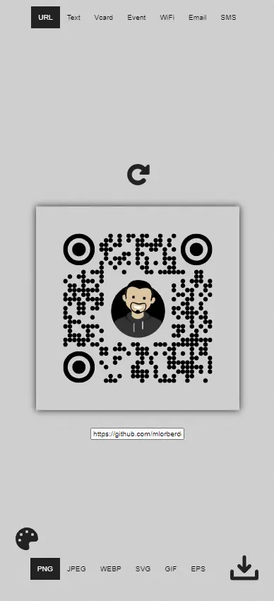
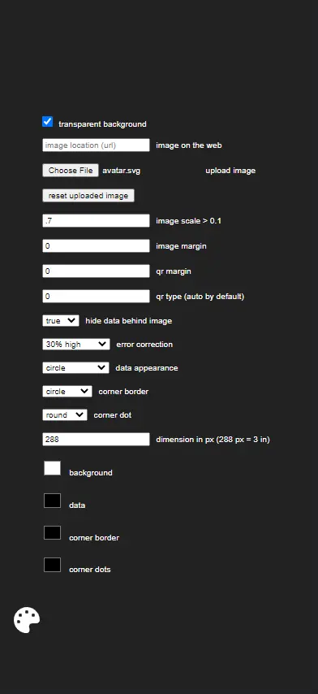

# QR-code-generator

This QR code generator accepts images and styles, and can make types: VCard, iCal, WiFi, URL, SMS, Email, and text.

[Homepage](https://qr-code-styler.netlify.app/)

## Screenshots

### Main

### Settings

## License
[CC BY 3.0 Attribution Required](https://creativecommons.org/licenses/by/3.0/)